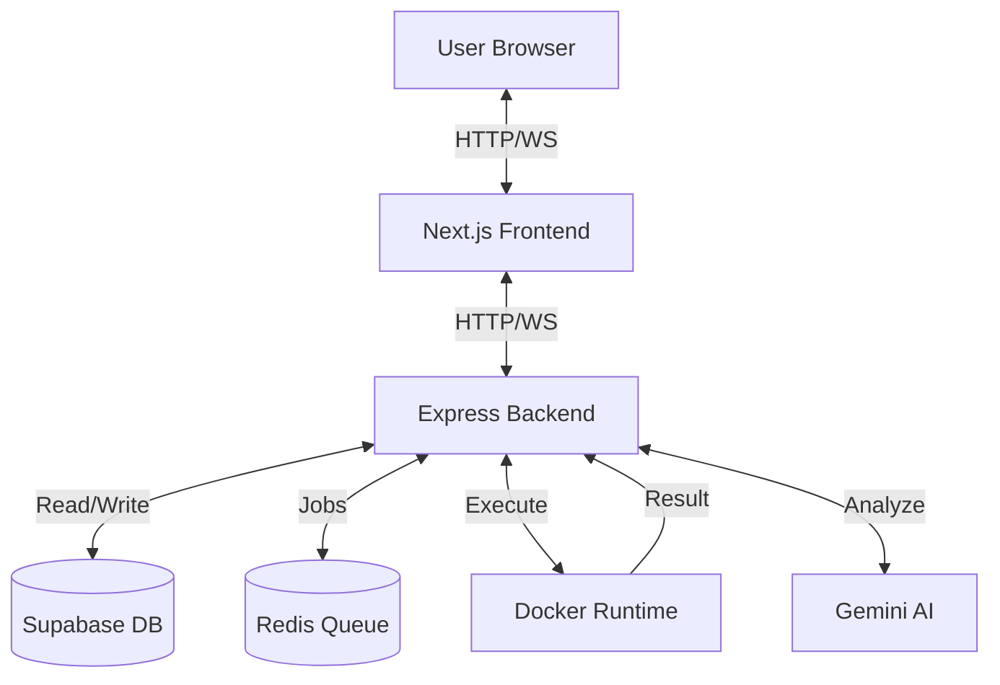

# 🧠 CodeGuard – Online Code Evaluation Platform


**CodeGuard** is a production-ready, full-stack web application designed for **secure, real-time code execution and evaluation**. It provides a robust environment for coding practice, assessments, and classroom management, powered by isolated Docker containers and an optimized pooling system to eliminate cold starts.

---

## 🚀 Features

### Core Execution
- **⚡ Zero-Latency Execution** – "Pre-warmed" container pools ensure code runs instantly without cold start delays.
- **🔒 Secure Sandboxing** – All code executes in isolated, resource-constrained Docker containers (Alpine Linux) to prevent malicious activity.
- **📝 Advanced Editor** – Monaco-based rich text editor with glassmorphism UI, smart language switching, and smooth resizing capabilities.
- **📶 Interactive Terminal** – WebSocket-based terminal facilitating real-time partial output streaming, infinite loop protection, and interactive input.

### AI & Intelligence
- **🤖 Clinical AI Intelligence** – Integrated Gemini AI for smart error diagnostics, code explanation, and automated hints.

### User Experience
- **✨ Premium UI** – Modern glassmorphism design with fluid animations and responsive layouts.
- **📱 Fully Responsive** – Mobile-first design with card/table hybrid views that adapt to any screen size.
- **⏳ Skeleton Loaders** – High-fidelity skeleton components for instant page rendering without blocking loaders.

### Administration
- **👩‍🏫 Faculty & Admin Dashboards** – Specialized interfaces for managing classes, students, and system resources.
- **📊 Detailed Analytics** – Track submission history, performance metrics, and automated grading results.
- **📥 Bulk User Import** – Import users from CSV or Excel files with drag-and-drop support.

---

## 🧩 Tech Stack

| Domain | Technologies |
|:---|:---|
| **Frontend** | **Next.js 16**, React 19, TypeScript, Tailwind CSS, Framer Motion, ShadCN UI |
| **Backend** | **Node.js**, Express.js 5, WebSocket (ws), BullMQ, Redis, Zod |
| **Infrastructure** | **Docker**, Docker Compose, Supabase (PostgreSQL + Auth) |
| **AI** | **Google Gemini 1.5** (Flash model) for error analysis and coding assistance |
| **Runtimes** | Python 3.12, OpenJDK 21, GCC (C/C++) on Alpine Linux |

---

## 🛠️ Instant Setup (Docker Compose)

The easiest way to run CodeGuard is using Docker Compose. This brings up the frontend, backend, Redis, and all language runtime environments automatically.

### Prerequisites
- Docker & Docker Compose
- Supabase credentials (for Auth/DB)

### 1. Configure Environment
Create a `.env` file in the root directory:
```env
# Core
NEXT_PUBLIC_API_URL=http://localhost:5002
NEXT_PUBLIC_SUPABASE_URL=your_supabase_url
NEXT_PUBLIC_SUPABASE_ANON_KEY=your_supabase_anon_key
SUPABASE_SERVICE_ROLE_KEY=your_service_role_key

# Docker Execution
DOCKER_MEMORY_LIMIT=128m
DOCKER_CPU_LIMIT=0.5
DOCKER_POOL_SIZE_PYTHON=2
DOCKER_POOL_SIZE_CPP=2
EXECUTION_TIMEOUT=15 # Seconds before an infinite loop is killed
```

### 2. Launch
```bash
docker-compose up --build
```
- **Frontend**: http://localhost:3000
- **Backend**: http://localhost:5002

---

## 💻 Manual Development Setup

If you prefer running services individually for development:

### Backend
1. Ensure **Docker** is running locally and **Redis** is available (default `localhost:6379`).
2. Navigate to `backend/` and install dependencies:
   ```bash
   cd backend
   npm install
   ```
3. Start the server (Development mode with hot-reload):
   ```bash
   npm run dev
   ```

### Frontend
1. Navigate to `frontend/`:
   ```bash
   cd frontend
   npm install
   ```
2. Start Next.js:
   ```bash
   npm run dev
   ```

### 🧪 Testing & Linting
- **Run Tests**: `npm test`
- **Lint Code**: `npm run lint`

---

## 🧱 Architecture Overview



---

## 🤝 Contributing
Contributions are welcome! Please fork the repository and submit a pull request for review.

1. Fork the Project
2. Create your Feature Branch (`git checkout -b feature/AmazingFeature`)
3. Commit your Changes (`git commit -m 'Add some AmazingFeature'`)
4. Push to the Branch (`git push origin feature/AmazingFeature`)
5. Open a Pull Request

## 📄 License
Distributed under the MIT License. See `LICENSE` for more information.
