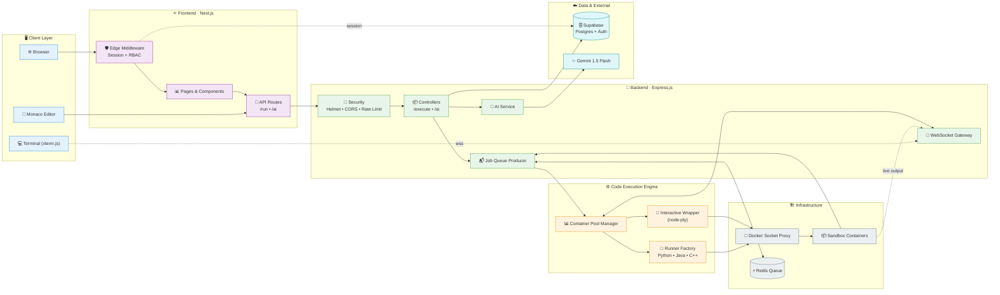

# 🧠 CodeGuard – Online Code Evaluation Platform


**CodeGuard** is a production-ready, full-stack web application designed for **secure, real-time code execution and evaluation**. It provides a robust environment for coding practice, assessments, and classroom management, powered by isolated Docker containers and an optimized pooling system to eliminate cold starts.

---

## 🔥 What's New in 3.0

- **🚀 Faculty Dashboard 2.0**: Completely optimized dashboard with **zero-latency TBT** (Total Blocking Time) and real-time performance analytics.
- **✨ AI-Driven Diagnostics**: Enhanced Gemini 1.5 Flash integration provides deeper code analysis, automated hints, and instant error resolution suggestions.
- **🛠️ Interactive STDIN Support**: Fully overhauled execution engine using `node-pty` for a true terminal experience with real-time user input.
- **📱 Fluid UI Refinement**: Responsive Recharts integration and adaptive navigation menus for seamless cross-device evaluation.

---

## 🚀 Features

### Core Execution
- **⚡ Zero-Latency Execution** – "Pre-warmed" container pools ensure code runs instantly without cold start delays.
- **🔒 Secure Sandboxing** – All code executes in isolated, resource-constrained Docker containers with a custom **Seccomp** profile and resource limits.
- **⌨️ Interactive Terminal** – Real-time partial output streaming via WebSockets and `node-pty`, supporting interactive user input and infinite loop protection.
- **📝 Advanced Editor** – Monaco-based rich text editor with glassmorphism UI, smart language switching, and smooth resizing capabilities.

### AI & Intelligence
- **🤖 Clinical AI Intelligence** – Integrated Gemini AI for automated code explanations, personalized feedback, and predictive error detection.

### Student & Faculty Experience
- **🔄 Smart Reattempt System** – Automated approval workflows for practical reattempts.
- **📈 Advanced Analytics** – Real-time Recharts-powered visualization for student progress and submission heatmaps.
- **📥 Bulk User Import** – High-performance CSV/Excel processing with validated record-by-record ingestion.

---

## 🧩 Tech Stack

| Domain | Technologies |
|:---|:---|
| **Frontend** | **Next.js 16**, React 19, TypeScript, Tailwind CSS, Framer Motion, ShadCN UI, Recharts |
| **Backend** | **Node.js**, Express.js 5, WebSocket (ws), BullMQ, Redis, node-pty |
| **Infrastructure** | **Docker**, Docker Compose, Supabase (PostgreSQL + Auth), Seccomp |
| **AI** | **Google Gemini 1.5 Flash** for deep code intelligence |
| **Runtimes** | Python 3.12, OpenJDK 21, GCC (C/C++) with custom interactive wrappers |

---

## 🗄️ Database Setup (Supabase)

CodeGuard uses a Supabase PostgreSQL schema snapshot stored in [`supabase/remote_schema_dump.sql`](supabase/remote_schema_dump.sql).

1. **Locate the Schema**: Use [`supabase/remote_schema_dump.sql`](supabase/remote_schema_dump.sql).
2. **Initialize Database**:
   - Open **Supabase Dashboard** → **SQL Editor**.
   - Paste the contents of `supabase/remote_schema_dump.sql`.
   - Execute the script.
3. **What it includes**:
   - Core application tables (users, practicals, submissions, exams, schedules, notifications, etc.)
   - Triggers and functions used by auth/session/submission flows
   - RLS policies and grants for role-based access

### Refreshing Schema Snapshot
If the remote database structure changes, regenerate the snapshot from the linked Supabase project:

```bash
npx supabase db dump --linked --schema public,auth,storage --file supabase/remote_schema_dump.sql
```

---

## 🛠️ Instant Setup (Docker Compose)

The easiest way to run CodeGuard is using Docker Compose. This brings up the frontend, backend, Redis, and all language runtime environments automatically.

### Prerequisites
- Docker & Docker Compose
- Supabase credentials (for Auth/DB)

### 1. Configure Environment
Create a `.env` file in the root directory:
```env
# --- Application ---
# Environment mode
NODE_ENV=development
# Frontend URL (for CORS)
CORS_ORIGIN=http://localhost:3000
# Backend API URL (used by Frontend)
NEXT_PUBLIC_API_URL=http://localhost:5002

# --- Supabase & Auth ---
NEXT_PUBLIC_SUPABASE_URL=your_supabase_url
NEXT_PUBLIC_SUPABASE_ANON_KEY=your_supabase_anon_key
SUPABASE_SERVICE_ROLE_KEY=your_service_role_key
# JWT Secret for internal signing
JWT_SECRET=super_secret_value

# --- AI Integration (Gemini) ---
AI_API_KEY=your_gemini_api_key
AI_PROVIDER=gemini
AI_MODEL=gemini-1.5-flash

# --- Infrastructure ---
REDIS_URL=redis://redis:6379

# --- Docker Execution Limits ---
DOCKER_MEMORY_LIMIT=128m
DOCKER_CPU_LIMIT=0.5
DOCKER_POOL_SIZE_PYTHON=2
EXECUTION_TIMEOUT=15
# Specify 'runsc' for gVisor execution on Production Linux servers
DOCKER_RUNTIME=
```

### Auth Behavior by Environment
- `NODE_ENV=development`: `/auth/register` is available.
- `NODE_ENV=production`: `/auth/register` is blocked by middleware and redirects to `/auth/login`.
- In production, the login page also hides the **Create an Account** action.

### 2. Launch
```bash
docker-compose up --build
```
- **Frontend**: http://localhost:3000
- **Backend**: http://localhost:5002

---

## 💻 Manual Development Setup

If you prefer running services individually for development:

### Backend
1. Ensure **Docker** is running locally and **Redis** is available (default `localhost:6379`).
2. Navigate to `backend/` and install dependencies:
   ```bash
   cd backend
   npm install
   ```
3. Start the server (Development mode with hot-reload):
   ```bash
   npm run dev
   ```

### Frontend
1. Navigate to `frontend/`:
   ```bash
   cd frontend
   npm install
   ```
2. Start Next.js:
   ```bash
   npm run dev
   ```

### 🧪 Testing & Linting
- **Run Tests**: `npm test`
- **Lint Code**: `npm run lint`

---

## 🧱 Architecture Overview


```mermaid
flowchart LR

%% ================= CLIENT =================
subgraph Client["🖥️ Client Layer"]
    Browser["🌐 Browser"]
    Monaco["📝 Monaco Editor"]
    Terminal["💻 Terminal (xterm.js)"]
end


%% ================= FRONTEND =================
subgraph Frontend["⚛️ Frontend · Next.js"]
    Middleware["🛡️ Edge Middleware\nSession + RBAC"]
    UI["📊 Pages & Components"]
    API["🔗 API Routes\n/run • /ai"]
end


%% ================= BACKEND =================
subgraph Backend["🚀 Backend · Express.js"]
    Security["🔐 Security\nHelmet • CORS • Rate Limit"]
    Routes["📦 Controllers\n/execute • /ai"]
    Socket["🔌 WebSocket Gateway"]
    Queue["📬 Job Queue Producer"]
    AIService["🤖 AI Service"]
end


%% ================= EXECUTION ENGINE =================
subgraph Engine["⚙️ Code Execution Engine"]
    Pool["📊 Container Pool Manager"]
    Runner["🏃 Runner Factory\nPython • Java • C++"]
    Wrapper["🔁 Interactive Wrapper\n(node-pty)"]
end


%% ================= INFRA =================
subgraph Infra["🏗️ Infrastructure"]
    DockerProxy["🐳 Docker Socket Proxy"]
    Containers["📦 Sandbox Containers"]
    Redis[("⚡ Redis Queue")]
end


%% ================= DATA =================
subgraph Data["☁️ Data & External"]
    Supabase[("🗄️ Supabase\nPostgres + Auth")]
    Gemini["✨ Gemini 1.5 Flash"]
end


%% ========= CLIENT → FRONTEND =========

Browser --> Middleware
Monaco --> API
Terminal -. wss .-> Socket

Middleware --> UI
UI --> API
Middleware -. session .-> Supabase


%% ========= FRONTEND → BACKEND =========

API --> Security
Security --> Routes

Routes --> Queue
Routes --> AIService
Routes --> Supabase


%% ========= QUEUE =========

Queue <--> Redis
Queue --> Pool


%% ========= EXECUTION =========

Socket <--> Pool
Pool --> Runner
Pool --> Wrapper

Runner --> DockerProxy
Wrapper --> DockerProxy
DockerProxy --> Containers


%% ========= OUTPUT =========

Containers --> Queue
Containers -. live output .-> Socket


%% ========= AI =========

AIService --> Gemini


%% ================= COLORS =================

classDef client fill:#E3F2FD,stroke:#1E88E5,stroke-width:1px
classDef frontend fill:#F3E5F5,stroke:#8E24AA,stroke-width:1px
classDef backend fill:#E8F5E9,stroke:#43A047,stroke-width:1px
classDef engine fill:#FFF3E0,stroke:#FB8C00,stroke-width:1px
classDef infra fill:#ECEFF1,stroke:#546E7A,stroke-width:1px
classDef data fill:#E0F7FA,stroke:#00838F,stroke-width:1px

class Browser,Monaco,Terminal client
class Middleware,UI,API frontend
class Security,Routes,Socket,Queue,AIService backend
class Pool,Runner,Wrapper engine
class DockerProxy,Containers,Redis infra
class Supabase,Gemini data
```

> **Key:** Solid lines (`──`) are HTTP/RPC calls. Dotted lines (`··`) are persistent WebSocket / PTY streams. Each container pool runs with `--network none`, memory caps, PID limits, and a custom Seccomp profile.

---

## 🤝 Contributing
Contributions are welcome! Please fork the repository and submit a pull request for review.

1. Fork the Project
2. Create your Feature Branch (`git checkout -b feature/AmazingFeature`)
3. Commit your Changes (`git commit -m 'Add some AmazingFeature'`)
4. Push to the Branch (`git push origin feature/AmazingFeature`)
5. Open a Pull Request


