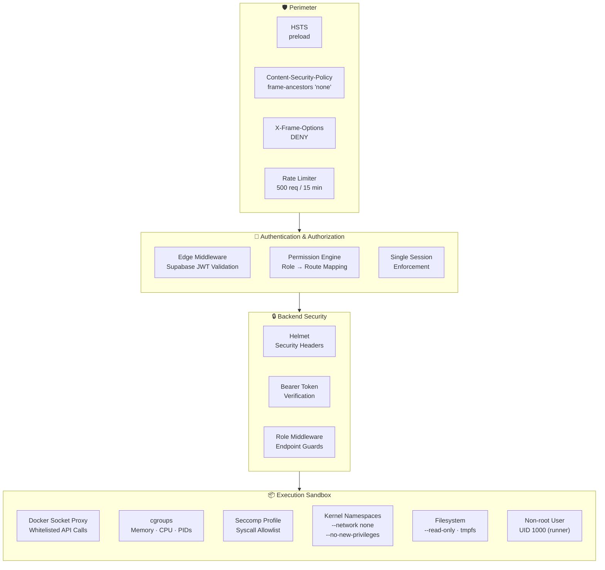

# 🔐 Security Policy

CodeGuard executes **arbitrary, untrusted user code** across multiple language runtimes. Because of this, security is the single most critical concern of the platform. This document describes every layer of defense in the system and how to responsibly disclose vulnerabilities.

---

## Table of Contents

- [Security Architecture](#security-architecture)
- [1. Container Isolation & Sandboxing](#1-container-isolation--sandboxing)
- [2. Seccomp Syscall Filtering](#2-seccomp-syscall-filtering)
- [3. Docker Socket Proxy](#3-docker-socket-proxy)
- [4. Network Isolation](#4-network-isolation)
- [5. Authentication](#5-authentication)
- [6. Authorization (RBAC)](#6-authorization-rbac)
- [7. Session Security](#7-session-security)
- [8. HTTP Security Headers](#8-http-security-headers)
- [9. Rate Limiting & DoS Protection](#9-rate-limiting--dos-protection)
- [10. Input Validation & Sanitization](#10-input-validation--sanitization)
- [11. Error Handling & Information Leakage](#11-error-handling--information-leakage)
- [12. Infrastructure Security](#12-infrastructure-security)
- [Threat Model](#threat-model)
- [Reporting a Vulnerability](#reporting-a-vulnerability)

---

## Security Architecture



> Every request must pass through **four security boundaries** before reaching a code execution sandbox.

---

## 1. Container Isolation & Sandboxing

All user code executes inside **purpose-built Docker containers** that are hardened with multiple overlapping defenses:

### Runtime Constraints

| Constraint | Python | Java | C/C++ |
|:---|:---|:---|:---|
| **Memory Limit** | `64m` | `128m` | `64m` |
| **CPU Limit** | `0.5` cores | `0.5` cores | `0.5` cores |
| **PID Limit** | `256` | `512` | `256` |
| **Execution Timeout** | `15s` | `15s` | `15s` |
| **Network** | `none` | `none` | `none` |
| **Filesystem** | Read-only + tmpfs | tmpfs only | tmpfs only |
| **Privilege Escalation** | Blocked | Blocked | Blocked |

### Container Flags

Every container is launched with the following security flags:

```bash
docker run --rm \
  --network none \                          # Zero network access
  --security-opt=no-new-privileges \        # Prevent privilege escalation
  -m 64m \                                  # Memory ceiling
  --cpus=0.5 \                              # CPU throttle
  --pids-limit 256 \                        # Fork bomb protection
  --read-only \                             # Immutable root filesystem (Python)
  --tmpfs /tmp:exec,rw,size=128m \          # Volatile scratch space
  --tmpfs /app/workspace:exec,rw,size=256m  # Code workspace
```

### Non-root Execution

All runtime containers run as a dedicated unprivileged user (`runner`, UID 1000). The `USER runner` directive is set in every Dockerfile, ensuring that even if code escapes the sandbox, it has minimal system privileges.

### Container Lifecycle

Containers are managed by the **Pool Manager** which:
1. **Pre-warms** containers at startup to eliminate cold-start delays
2. **Resets workspace** between executions (`rm -rf /tmp/*`, `pkill` stale processes)
3. **Dynamically scales** by creating new containers when the pool is exhausted
4. **Gracefully shuts down** all containers on `SIGTERM` / `SIGINT`

---

## 2. Seccomp Syscall Filtering

CodeGuard ships with a custom Seccomp profile ([`seccomp-codeguard.json`](backend/seccomp-codeguard.json)) that uses a **default-deny allowlist** approach:

```json
{
  "defaultAction": "SCMP_ACT_ERRNO"
}
```

- **Default action**: `SCMP_ACT_ERRNO` — any syscall not explicitly listed is **denied silently**
- **~170 allowed syscalls**: Only the minimum set required for compilation and execution (e.g., `read`, `write`, `execve`, `mmap`, `brk`, `clone`, `futex`)
- **Explicitly blocked**: `ptrace`, `mount`, `umount`, `reboot`, `swapon`, `kexec_load`, `init_module`, `pivot_root`, and all other privileged syscalls
- **Multi-arch support**: x86_64, x86, x32, ARM, and AArch64

---

## 3. Docker Socket Proxy

The backend **never mounts** the Docker socket directly. Instead, all Docker operations go through the [Tecnativa Docker Socket Proxy](https://github.com/Tecnativa/docker-socket-proxy) over TCP:

```yaml
docker-socket-proxy:
  environment:
    CONTAINERS: 1  # List, inspect
    POST: 1        # Create containers
    EXEC: 1        # Run commands
    IMAGES: 1      # Pull/List images
    NETWORKS: 0    # ❌ Block network manipulation
    VOLUMES: 0     # ❌ Block volume manipulation
```

**Why this matters**: Even if the backend itself were compromised, the attacker cannot:
- Create or modify Docker networks
- Mount host volumes
- Access the full Docker API surface

The backend connects via `DOCKER_HOST=tcp://docker-socket-proxy:2375` on a private bridge network.

---

## 4. Network Isolation

### Container Level
Every execution container runs with `--network none`, meaning:
- No DNS resolution
- No outbound HTTP/HTTPS
- No socket connections
- No exfiltration of data via network

### Infrastructure Level
```
┌──────────────────────────────────────────────┐
│  app_net (bridge)                            │
│  ┌──────────┐  ┌─────────┐  ┌─────────────┐ │
│  │ Frontend │  │ Backend │  │ Redis       │ │
│  └──────────┘  └─────────┘  └─────────────┘ │
│                ┌─────────────────────┐       │
│                │ Docker Socket Proxy │       │
│                └─────────────────────┘       │
└──────────────────────────────────────────────┘

Execution containers: --network none (fully isolated)
Redis: NOT exposed to host (internal bridge only)
```

---

## 5. Authentication

### Frontend (Edge Middleware)

The Next.js Edge Middleware (`middleware.ts`) runs at the network edge and:
1. **Validates Supabase JWT tokens** via `supabase.auth.getUser()` on every protected route
2. Redirects unauthenticated users to `/auth/login` with a safe redirect parameter
3. Normalizes and sanitizes URL paths with NFKC unicode normalization
4. Blocks access to `/auth/register` in production (registration disabled)

### Backend (Express Middleware)

The Express `authMiddleware` extracts the `Bearer <token>` from the `Authorization` header and:
1. Validates the token against the Supabase auth service
2. Attaches the verified `user` object to `req.user`
3. Returns structured `401` errors with specific codes (`AUTH_REQUIRED`, `AUTH_INVALID_TOKEN`)

### WebSocket Authentication

WebSocket connections include the Supabase access token as a query parameter:
```
wss://api.example.com?token=<supabase_access_token>
```

The `socketService` validates this token via `supabase.auth.getUser(token)` **before accepting the connection**. Invalid or missing tokens result in immediate `ws.close(1008, 'Unauthorized')`.

---

## 6. Authorization (RBAC)

### Permission Engine (ABAC-ready)

Roles are mapped to granular permissions, and routes require specific permissions:

```
admin   → [access:admin, access:profile, access:shared]
faculty → [access:faculty, access:profile, access:shared]
student → [access:student, access:profile, access:interactive, access:shared]
```

### Route Permission Matrix

| Route Prefix | Required Permission |
|:---|:---|
| `/admin`, `/dashboard/admin` | `access:admin` |
| `/faculty`, `/dashboard/faculty` | `access:faculty` |
| `/student`, `/dashboard/student` | `access:student` |
| `/interactive` | `access:interactive` |
| `/profile` | `access:profile` |
| `/notifications` | `access:shared` |

Routes are matched **longest-prefix-first** to prevent bypass via overlapping paths.

### Backend Role Guard

The `requireRole` middleware provides endpoint-level authorization:
```javascript
app.use('/admin-endpoint', authMiddleware, requireRole(['admin']), handler);
```

---

## 7. Session Security

### Single Session Enforcement

CodeGuard enforces **one active session per user** to prevent account sharing during exams:

1. A `device_session_id` cookie is issued when a user enters the editor
2. The `active_session_id` is stored in the `users` table
3. On every protected route request, the middleware compares the cookie value against the database
4. If they don't match → the session is invalidated, auth cookies are deleted, and the user is redirected to login

### Cookie Security

All authentication cookies are set with:
- `httpOnly: true` — prevents XSS from reading cookies
- `secure: true` (production) — cookies only sent over HTTPS
- `sameSite: 'lax'` — CSRF protection

### Emergency Controls

| Flag | Effect |
|:---|:---|
| `AUTH_LOCKDOWN=true` | Redirects ALL routes to `/lockdown` |
| `FEATURE_FREEZE=true` | Blocks access to `/dashboard/*` |

---

## 8. HTTP Security Headers

The Edge Middleware injects the following headers on **every response**:

| Header | Value | Purpose |
|:---|:---|:---|
| `Strict-Transport-Security` | `max-age=31536000; includeSubDomains; preload` | Force HTTPS |
| `X-Frame-Options` | `DENY` | Clickjacking prevention |
| `X-Content-Type-Options` | `nosniff` | MIME sniffing protection |
| `Referrer-Policy` | `strict-origin-when-cross-origin` | Referrer leakage prevention |
| `X-Permitted-Cross-Domain-Policies` | `none` | Flash/PDF embed prevention |
| `Content-Security-Policy` | `frame-ancestors 'none'; upgrade-insecure-requests` | Frame embedding + HTTPS upgrade |
| `Permissions-Policy` | `camera=(), microphone=(), geolocation=(), interest-cohort=()` | Feature restriction + FLoC opt-out |

The backend additionally uses **Helmet.js** for Express-level security headers.

---

## 9. Rate Limiting & DoS Protection

### HTTP Rate Limiting

```
Window:  15 minutes
Max:     500 requests per IP
Headers: RateLimit-* standard headers
```

Exceeding the limit returns `429 Too Many Requests` with a structured JSON error.

### WebSocket Concurrency

```
Max concurrent WebSocket connections: 200
```

New connections beyond this limit are rejected with `ws.close(1008, 'Server busy')`.

### Execution Safeguards

| Safeguard | Value |
|:---|:---|
| Code execution timeout | `15 seconds` |
| Request body size limit | `5 MB` |
| Container PID limit | `256` (Python/C), `512` (Java) |
| Container memory limit | `64m` (Python/C), `128m` (Java) |
| BullMQ concurrency | `20` concurrent jobs |

---

## 10. Input Validation & Sanitization

### URL Path Normalization

The Edge Middleware performs **multi-layer URL sanitization**:
1. `decodeURIComponent()` — decode percent-encoded characters
2. `.normalize("NFKC")` — Unicode compatibility normalization (prevents homoglyph attacks)
3. `.toLowerCase()` — case normalization
4. Trailing slash removal
5. Malformed URLs → redirect to `/unauthorized`

### Redirect Safety

All redirect targets are validated:
- Must start with `/` (no open redirect to external domains)
- Must not contain `//` (no protocol-relative URLs)
- Max length: `2048` characters
- Invalid redirects fall back to `/dashboard`

### Environment Validation

Backend configuration uses **Zod schema validation** at startup. Missing or invalid environment variables cause an immediate `process.exit(1)` with descriptive errors — the server will not start in a misconfigured state.

---

## 11. Error Handling & Information Leakage

### Production Error Sanitization

In production mode:
- Stack traces are **never** sent to the client
- Generic error messages replace detailed internal errors
- Operational errors (expected) vs programming errors (bugs) are handled separately

### Security Event Logging

The middleware logs structured security events for audit:
```json
{
  "type": "SECURITY_EVENT",
  "event": "AUTH_BLOCKED",
  "requestId": "uuid",
  "path": "/admin",
  "reason": "PERMISSION_DENIED",
  "role": "student",
  "timestamp": "2026-03-30T..."
}
```

Logged events include: `MALFORMED_URL`, `AUTH_BLOCKED`, `SESSION_INVALIDATED`, `POLICY_MISSING`, `CRITICAL_ENV_MISSING`.

---

## 12. Infrastructure Security

### Database (Supabase)

- **Row-Level Security (RLS)** policies enforce data access at the database level
- Service role keys are **never exposed** to the client
- The `SUPABASE_SERVICE_ROLE_KEY` is only used server-side in API routes

### Redis

- Runs on an **internal bridge network** only — not exposed to the host
- AOF persistence enabled for data durability
- Used solely for BullMQ job queue state — no sensitive data stored

### Docker Images

- All runtime images use **slim/minimal base images** (`python:3.11-slim`, `debian:bookworm-slim`)
- Multi-stage builds for C/C++ (builder stage discarded)
- Package lists cleaned after install (`rm -rf /var/lib/apt/lists/*`)
- Thread count limited (`OPENBLAS_NUM_THREADS=1`, `MKL_NUM_THREADS=1`)

---

## Threat Model

| Threat | Mitigation |
|:---|:---|
| **Remote Code Execution** | Sandboxed containers with cgroups, Seccomp, `--network none` |
| **Container Escape** | `--no-new-privileges`, non-root user, Seccomp syscall filter |
| **Fork Bomb** | `--pids-limit 256/512` per container |
| **Memory Exhaustion** | `-m 64m/128m` hard memory caps |
| **Network Exfiltration** | `--network none` on all execution containers |
| **Privilege Escalation** | `--security-opt=no-new-privileges`, non-root user |
| **XSS** | `httpOnly` cookies, CSP headers, Helmet |
| **CSRF** | `sameSite: lax` cookies, CORS origin validation |
| **Clickjacking** | `X-Frame-Options: DENY`, `frame-ancestors 'none'` |
| **Session Hijacking** | Single-session enforcement, secure cookie flags |
| **Brute Force** | Rate limiting (500 req/15min), structured lockout |
| **Path Traversal** | NFKC normalization, prefix-match authorization |
| **Open Redirect** | Redirect validation (starts with `/`, no `//`, max length) |
| **Docker Socket Abuse** | TCP proxy with whitelisted operations only |
| **Information Leakage** | Production error sanitization, no stack traces |

---

## Reporting a Vulnerability

We take security vulnerabilities seriously. If you discover a security issue, please report it responsibly.

### How to Report

1. **Email**: Send a detailed report to the repository maintainer (see profile)
2. **Do NOT** open a public GitHub issue for security vulnerabilities
3. Include:
   - Description of the vulnerability
   - Steps to reproduce
   - Potential impact assessment
   - Suggested fix (if any)

### Response Timeline

| Stage | Timeframe |
|:---|:---|
| Acknowledgment | Within **48 hours** |
| Initial assessment | Within **1 week** |
| Fix deployed | Within **2 weeks** (critical), **4 weeks** (moderate) |

### Scope

The following are **in scope** for security reports:
- Authentication/authorization bypasses
- Container escape or sandbox bypass
- Code execution outside intended sandbox
- Data exposure or unauthorized access
- XSS, CSRF, or injection vulnerabilities
- Denial of service via resource exhaustion

The following are **out of scope**:
- Issues in third-party dependencies (report upstream)
- Social engineering attacks
- Physical access attacks

---

## Supported Versions

| Version | Supported |
|:---|:---|
| 3.x (current) | ✅ Active support |
| 2.x | ⚠️ Critical fixes only |
| 1.x | ❌ End of life |
